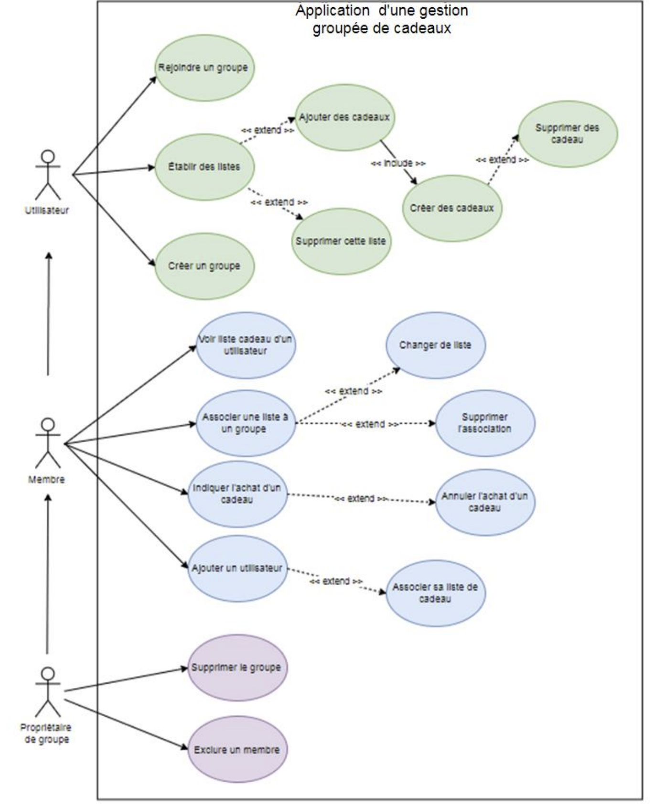

<h1 align="center">
  
</h1>

---

# GESTION DE CADEAUX

## Petit résumé
- Il n’est pas toujours évident pour les autres de trouver les cadeaux qui nous feront
plaisir ou de trouver des idées de cadeaux pour nos amis et notre famille.

## Objectifs
- Concevoir une application web pour la gestion des cadeaux de Noël.
- Eviter les doublons dans les achats
- Eviter d'acheter des cadeaux qui pourrait ne pas plaire à son destinataire.

## Techno
- HTML
- CSS
- SQL
- JavaScript
- PHP
- PhpMyAdmin

## UML

## UI

## Auteur
- [@Pierre](https://github.com/Pierre-Portfolio)